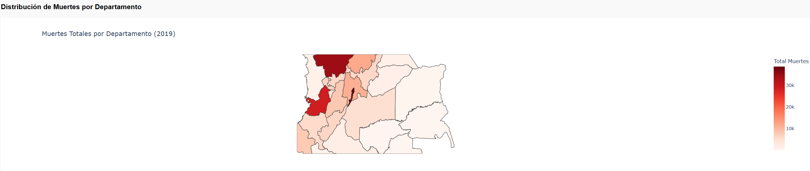
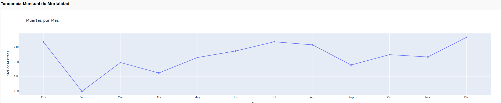
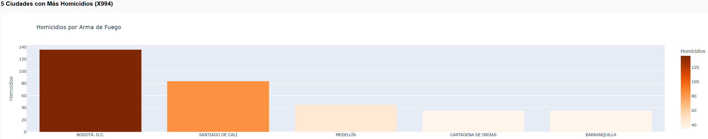
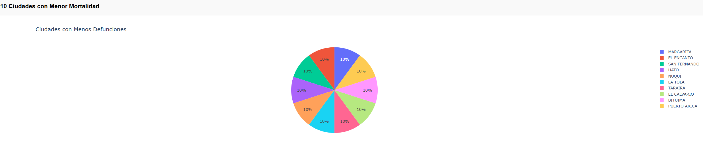
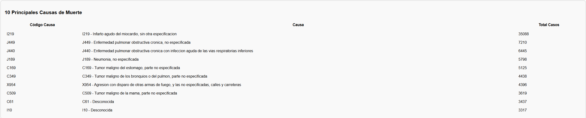
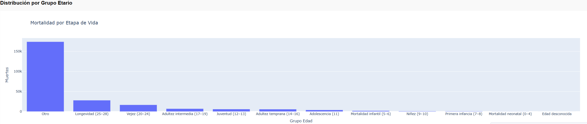

# Análisis Interactivo de Mortalidad en Colombia - 2019

## Introducción del Proyecto
Esta aplicación web dinámica, desarrollada con **Dash y Plotly en Python**, analiza los datos de mortalidad no fetal en Colombia para el año 2019, utilizando microdatos del DANE. Permite explorar patrones demográficos, regionales y temporales a través de visualizaciones interactivas, facilitando la identificación de tendencias como la concentración de muertes en Bogotá y Antioquia.

## Objetivo
Proporcionar una herramienta accesible para investigadores y policymakers que busque visualizar y analizar:
- Distribución geográfica de muertes por departamento.
- Tendencias mensuales.
- Causas principales y patrones por género y edad.

## Estructura del Proyecto

mortalidad-colombia-2019/
├── app.py              # Aplicación Dash principal
├── requirements.txt    # Dependencias Python
├── README.md           # Esta documentación
└── data/               # Archivos Excel del DANE
├── NoFetal2019.xlsx
├── CodigosDeMuerte.xlsx
└── Divipola.xlsx

## Requisitos
- Python 3.8+
- Librerías: `dash==2.17.1`, `plotly==5.22.0`, `pandas==2.2.3`, `openpyxl==3.1.5`, `gunicorn==22.0.0`

## Despliegue en Railway
1. Clona el repo: `git clone https://github.com/darkydres/mortalidad-colombia-2019.git`
2. Instala dependencias: `pip install -r requirements.txt`
3. Ejecuta localmente: `python app.py`
4. Para producción en Railway: Conecta el repo en [railway.app](https://railway.app) → Auto-despliegue.

## Software Utilizado
- **Python 3.12** con Dash/Plotly para web interactiva.
- **Pandas/OpenPyXL** para procesamiento de Excel.
- **Railway** como PaaS para hosting gratuito.

## Instalación Local
1. Clona el repositorio.
2. Instala dependencias: `pip install -r requirements.txt`
3. Ejecuta: `python app.py`.
4. Abre: http://localhost:8050.

## Visualizaciones y Explicaciones de Resultados

### 1. Mapa: Distribución de Muertes por Departamento

*Hallazgo*: Bogotá D.C. lidera con 38,760 muertes (15% nacional), seguida de Antioquia (34,473). Colores rojos indican alta mortalidad en centros urbanos.

### 2. Gráfico de Líneas: Muertes por Mes

*Hallazgo*: Pico en noviembre, con tendencia estable ~20,000/mes.

### 3. Barras: 5 Ciudades Más Violentas (Homicidios X994)

*Hallazgo*: Bogotá (136 homicidios), Cali (84), Medellín (45) — violencia concentrada en capitales.

### 4. Gráfico Circular: 10 Ciudades con Menor Mortalidad

*Hallazgo*: Municipios rurales como Leticia (Amazonas) tienen <10 muertes, representando <0.1% nacional.

### 5. Tabla: 10 Principales Causas de Muerte

*Hallazgo*: Enfermedades cerebrovasculares (I60-I69) #1 con ~25,000 casos; homicidios (X85-Y09) #8.

### 6. Barras Apiladas: Muertes por Sexo y Departamento

*Hallazgo*: Hombres representan 55% nacional, con brecha mayor en Antioquia (60% hombres).

### 7. Histograma: Distribución por Grupo Etario

*Hallazgo*: Vejez (60-84 años) domina con 40% muertes; mortalidad infantil <5%.

**App en vivo**: https://mortalidad-colombia-2019-production.up.railway.app
**Datos fuente**: DANE

---
Desarrollado por: 
ANDRES FELIPE ABELLO DIAZ
JENNY PATRICIA CASTRO SOLANO 
Maestría Inteligencia Artificial Unisalle, 2025.